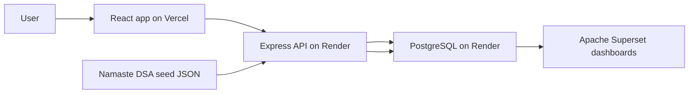

# Architecture

## High-Level System

## Runtime Boundaries

### Client

Location: `client/`

Responsibilities:

- Render dashboard, DSA bank, daily log, and roadmap.
- Call backend API through `client/src/lib/api.js`.
- Keep UI state local and short-lived.
- No direct database access.

Important files:

- `client/src/App.jsx`: main UI and client state.
- `client/src/lib/api.js`: API wrapper.
- `client/src/styles.css`: global styling.

### Server

Location: `server/`

Responsibilities:

- Provide JSON API under `/api`.
- Persist question progress and study logs.
- Serve metrics derived from Postgres.
- Seed questions from `server/data/namaste-dsa-questions.json`.

Important files:

- `server/src/index.js`: Express routes.
- `server/src/db.js`: PostgreSQL pool and SQL file runner.
- `server/src/seed.js`: schema + seed + views setup.

### Database

Location: `db/`

Responsibilities:

- Store question catalog.
- Store user progress per question.
- Store daily study logs.
- Expose Superset-friendly views.

Important files:

- `db/schema.sql`
- `db/views.sql`

## Data Flow

1. `npm run seed` creates tables and inserts Namaste DSA questions.
2. React requests `/api/questions`.
3. Express joins `questions` with `question_progress`.
4. User marks a question `Solved`, `Revise`, or `Todo`.
5. Express upserts into `question_progress`.
6. Dashboard calls `/api/metrics` to show updated totals.
7. Superset reads analytics views from the same Postgres database.

## Deployment Shape

- Vercel deploys only `client/`.
- Render deploys the Node API and provisions PostgreSQL.
- Superset connects to the Render Postgres connection string.

## Important Architectural Decisions

- PostgreSQL is the source of truth; no browser `localStorage` for durable progress.
- Seed data is JSON in the backend to keep the client small and database-first.
- Superset is supported through SQL views rather than app-specific analytics code.
- The app is currently single-user by design. Multi-user auth is future work.
