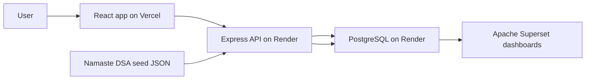

# Architecture

## High-Level System

## Runtime Boundaries

### Client

Location: `client/`

Responsibilities:

- Render dashboard, DSA bank, daily log, and roadmap.
- Render the day-by-day interview weekly plan as the primary workflow.
- Call backend API through `client/src/lib/api.js`.
- Keep UI state local and short-lived.
- No direct database access.

Important files:

- `client/src/App.jsx`: main UI and client state.
- `client/src/lib/api.js`: API wrapper.
- `client/src/styles.css`: global styling.

### Server

Location: `server/`

Responsibilities:

- Provide JSON API under `/api`.
- Handle passwordless Gmail OTP login and HTTP-only session cookies.
- Persist question progress, milestone progress, and study logs.
- Serve metrics derived from Postgres.
- Seed questions from `server/data/namaste-dsa-questions.json`.

Important files:

- `server/src/index.js`: Express routes.
- `server/src/db.js`: PostgreSQL pool and SQL file runner.
- `server/src/seed.js`: schema + seed + views setup.

### Database

Location: `db/`

Responsibilities:

- Store question catalog.
- Store user progress per question.
- Store daily study logs.
- Store weekly milestone progress.
- Expose Superset-friendly views.

Important files:

- `db/schema.sql`
- `db/views.sql`

## Data Flow

1. `npm run seed` creates tables and inserts Namaste DSA questions.
2. React checks `/api/auth/me`; unauthenticated users see the Gmail OTP login screen.
3. User requests and verifies a Gmail OTP; Express stores hashed OTPs and creates an HTTP-only session cookie.
4. After first login, React requires a LeetCode username and saves it on `app_users`.
5. React requests `/api/weekly-plan` for the default commitment-first experience.
6. Express joins `questions` with `question_progress`, overlays seed-backed weekly milestones with `milestone_progress`, maps weekly DSA work to curated Core 100 question IDs, attaches curated frontend resource links, and attaches optional weekly bonus topics.
7. React requests `/api/questions` for full-bank reference mode, defaulting to the full seeded dataset with computed priority labels.
8. User opens NamasteDev or LeetCode links from plan or bank cards.
9. User marks a question `Revise` or `Todo`; Express upserts directly into `question_progress`.
10. User marks a question `Solved`; Express first verifies accepted LeetCode submissions for the logged-in user's saved LeetCode username and the question `leetcode_slug`.
11. User marks weekly DSA, JavaScript, React LLD, HLD, or revision milestones `Done`, `Revise`, or `Todo`; optional performance/accessibility/security bonus topics remain untracked stretch work.
12. Dashboard calls `/api/metrics` to show updated Core 100, full-bank, and milestone totals.
13. Superset reads analytics views from the same Postgres database.

## Deployment Shape

- Vercel deploys only `client/`.
- Render deploys the Node API and provisions PostgreSQL.
- Superset connects to the Render Postgres connection string.

## Important Architectural Decisions

- PostgreSQL is the source of truth; no browser `localStorage` for durable progress.
- Passwordless auth stores only hashed OTPs and hashed session tokens.
- Seed data is JSON in the backend to keep the client small and database-first.
- Weekly interview milestones are seed-backed in the API while milestone status is persisted in Postgres.
- Frontend resource links are curated in `frontendResourcePlan` so LearnersBucket, Namaste FSD, GreatFrontend, devtools.tech, and Patterns.dev links can evolve without changing the database schema.
- The Core 100 is a backend-defined curation layer over the 243 seeded questions, not a destructive data reduction.
- Superset is supported through SQL views rather than app-specific analytics code.
- `Solved` is verification-gated for LeetCode-linked items instead of being a manual trust toggle.
- The app is currently single-user by design. Multi-user auth is future work.
